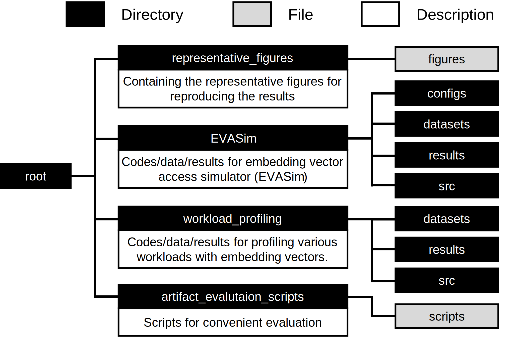
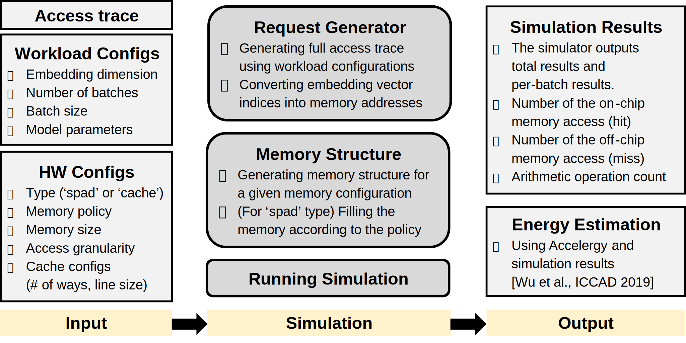

# Efficient Embedding Vector Operations  \(Ongoing Project)

## Table of Contents
- [Introduction](#introduction)
- [Embedding Vector Access Simulator (EVASim)](#embedding-vector-access-simulator-evasim-working-in-progress)
- [Embedding Vector Profiler](#embedding-vector-profiler)
- [Scripts for Artifact Evaluation](#scripts-for-artifact-evaluation)

## Introduction
This repository contains an artifact for "Efficient Embedding Vector Operation (TBD)" paper, which aims to enhance the energy efficiency of hardware accelerators for various embedding vector operations.
The figure below represents the organization of this repository.

    

- `representative_figures` directory contains the representative figures shown in the paper. You can check the intended results using those figures.
- `EVASim` directory contains the codes and data for our embeddding vector access simulator (EVASim). The simulator can simulate memory behavior of accelerators (e.g., access, caching). We are planning to integrate the simulator with a DNN accelerator simulator.
- `workload_profiling` directory contains the codes and data for profiling various embedding vector operation workloads. Currently, we implement three profiling codes for DLRM, transformer, and vector database (DB).
- `artifact_evaluation_scripts` directory provides bash shell scripts for easy, and fast evaluation.  

## Embedding Vector Access Simulator (EVASim, Working in Progress)
We design this simulator to evaluate how efficiently the on-chip memory system captures hot embedding vectors.
Currently, the simulator supports a two-level memory hierarchy, which consists of the on-chip memory system (e.g., scratchpad memory or cache), and off-chip memory system (e.g., DRAM, HBM).
The simulator takes an embedding vector access trace, workload configuration, and memory configuration as input, then outputs the on-chip and off-chip memory access counts, as well as the on-chip memory access ratio.
The figure below shows an overview of EVASim.

    

  

We implement the simulation running script and request generator module based on the prior work [Jain et al., ISCA 2023] [Jain et al., MICRO 2024].  

## Embedding Vector Profiler
To be added...  

## Scripts for Artifact Evaluation
To be added...  

