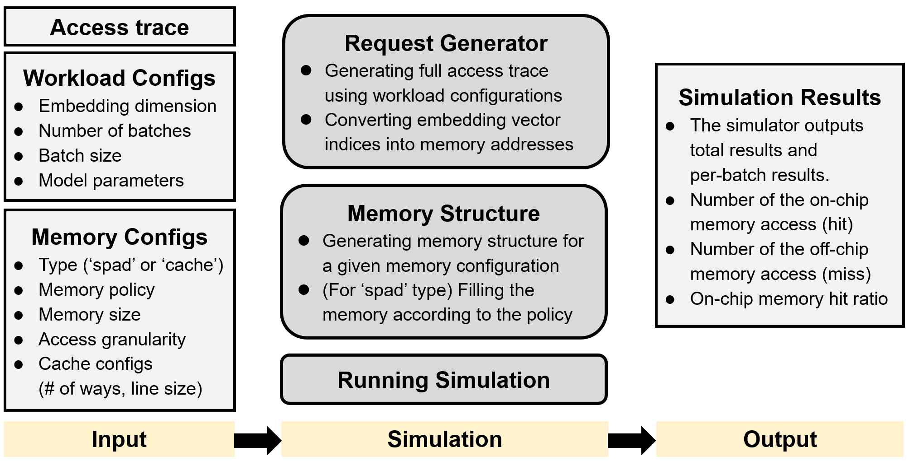

# Embedding Vector Access Simulator (EVASim, working in progress)

## Introduction
We design this simulator to evaluate how efficiently the on-chip memory system captures hot embedding vectors.
Currently, the simulator supports a two-level memory hierarchy, which consists of the on-chip memory system (e.g., scratchpad memory or cache), and off-chip memory system (e.g., DRAM, HBM).
The simulator takes an embedding vector access trace, workload configuration, and memory configuration as input, then outputs the on-chip and off-chip memory access counts, as well as the on-chip memory access ratio.
The figure below shows an overview of EVASim.

We implement the simulation running script and request generator module based on the prior work [Jain et al., ISCA 2023] [Jain et al., MICRO 2024].
